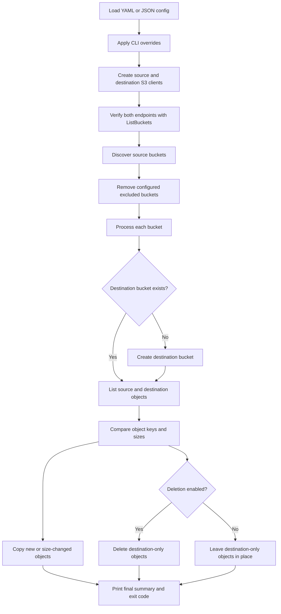
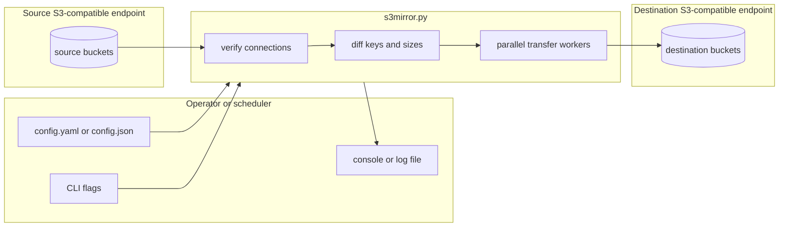
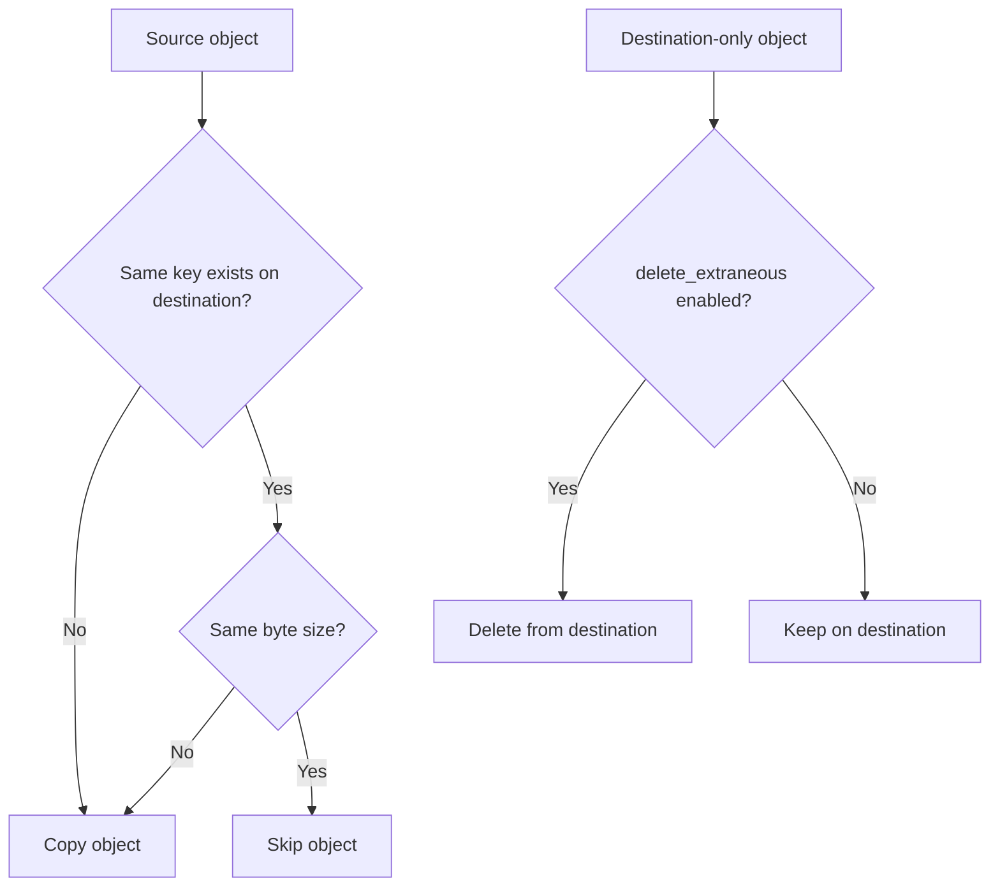

# 🪞 S3 Mirror

> A Python utility for mirroring buckets and objects between S3-compatible endpoints.

[](https://github.com/soakes/s3mirror/actions/workflows/lint.yml)
[](https://github.com/soakes/s3mirror/actions/workflows/format.yml)
[](https://www.python.org/)
[](LICENSE)
[](https://github.com/soakes/s3mirror/issues)

Built for operators who need a small, inspectable, automation-friendly mirror
tool for AWS S3, MinIO, Ceph, Wasabi, Backblaze B2, and other S3-compatible
storage systems.

**Quick links:** [🚀 Quick Start](#quick-start) · [⚙️ Configuration](#configuration) · [🔄 How It Works](#how-it-works) · [🧪 Usage](#usage) · [🛡️ Safety Notes](#safety-notes) · [🤖 CI/CD](#cicd)

<a id="table-of-contents"></a>
## 🧭 Table of Contents

- [📖 Overview](#overview)
- [✨ Capabilities](#capabilities)
- [🔄 How It Works](#how-it-works)
- [✅ Prerequisites](#prerequisites)
- [🚀 Quick Start](#quick-start)
- [⚙️ Configuration](#configuration)
- [🧪 Usage](#usage)
- [📋 Operational Behavior](#operational-behavior)
- [📜 Logging](#logging)
- [🛡️ Safety Notes](#safety-notes)
- [🤖 CI/CD](#cicd)
- [🗂️ Project Structure](#project-structure)
- [🩺 Troubleshooting](#troubleshooting)
- [🤝 Contributing](#contributing)
- [📄 License](#license)

---

<a id="overview"></a>
## 📖 Overview

`s3mirror` copies buckets and objects from one S3-compatible endpoint to another.
It is intentionally direct: one script, one config file, and clear logs that are
usable from an interactive shell, cron, systemd timers, or CI jobs.

In normal operation it does five things:

- loads YAML or JSON configuration
- verifies source and destination S3 connectivity
- discovers source buckets, excluding any configured bucket names
- creates missing destination buckets
- copies new or size-changed objects and optionally deletes destination-only objects

The project was created as an independent alternative to relying on vendor
specific mirror tooling. It uses `boto3`, so the behavior is easy to audit and
the same workflow can be pointed at most S3-compatible services.

### First Run Checklist

1. Create a dedicated source credential with read access to the buckets you want mirrored.
2. Create a dedicated destination credential with bucket creation, upload, list, and delete permissions as needed.
3. Start with `delete_extraneous: false` or use `--no-delete` for the first validation run.
4. Run with `--debug` once to confirm bucket discovery, object counts, and transfer decisions.
5. Enable deletion only after the copy-only behavior looks correct.
6. For scheduled runs, use `--log-file` and alert on non-zero exit codes.

---

<a id="capabilities"></a>
## ✨ Capabilities

- **S3-compatible endpoints**: works with AWS S3 and S3-compatible APIs such as MinIO, Ceph, Wasabi, and Backblaze B2.
- **Whole-bucket mirroring**: discovers source buckets and mirrors each one to the destination.
- **Destination bootstrap**: creates missing destination buckets before copying objects.
- **Parallel transfers**: uses a configurable thread pool for copy and delete operations.
- **Multipart uploads**: uses `boto3` transfer configuration for larger object uploads.
- **Optional true mirror mode**: removes destination-only objects when deletion is enabled.
- **Bucket exclusions**: skips configured buckets that should not be mirrored.
- **YAML or JSON config**: keeps endpoint credentials, performance tuning, and sync behavior in one file.
- **CLI overrides**: lets operators override worker count and deletion behavior at runtime.
- **Automation-friendly logging**: supports normal, quiet, debug, and file logging modes.
- **CI validation**: checks formatting and linting across supported Python versions.

---

<a id="how-it-works"></a>
## 🔄 How It Works

At runtime, `s3mirror` follows a simple reconciliation loop over every source
bucket:



The deployment shape is deliberately small:



Object decisions are based on object key presence and byte size:



Important detail: this tool currently compares keys and sizes, not object
checksums or metadata. If two objects have the same key and size but different
content, `s3mirror` will treat them as already synchronized.

---

<a id="prerequisites"></a>
## ✅ Prerequisites

- Python `3.10+`
- Network access to both S3-compatible endpoints
- Source credentials with permission to list buckets and read objects
- Destination credentials with permission to list buckets, create buckets, upload objects, and delete objects if mirror deletion is enabled
- `pip` for installing Python dependencies

The runtime dependencies are listed in [`requirements.txt`](requirements.txt):

- `boto3`
- `urllib3`
- `PyYAML`

---

<a id="quick-start"></a>
## 🚀 Quick Start

Clone the repository and create a virtual environment:

```bash
git clone https://github.com/soakes/s3mirror.git
cd s3mirror
python3 -m venv .venv
source .venv/bin/activate
pip install -r requirements.txt
```

Create a configuration file:

```yaml
source:
  endpoint_url: "https://s3.source.example.com"
  aws_access_key_id: "SOURCE_ACCESS_KEY"
  aws_secret_access_key: "SOURCE_SECRET_KEY"
  region_name: "us-east-1"
  verify_ssl: true

destination:
  endpoint_url: "https://s3.destination.example.com"
  aws_access_key_id: "DEST_ACCESS_KEY"
  aws_secret_access_key: "DEST_SECRET_KEY"
  region_name: "us-east-1"
  verify_ssl: true

performance:
  max_workers: 20
  multipart_threshold: 8388608
  multipart_chunksize: 8388608
  max_concurrency: 10
  max_pool_connections: 50

sync:
  delete_extraneous: false
  exclude_buckets: []
```

Run a copy-only validation pass:

```bash
python3 s3mirror.py --config config.yaml --no-delete --debug
```

When the output looks correct, run with the deletion behavior from the config:

```bash
python3 s3mirror.py --config config.yaml --log-file /var/log/s3mirror.log
```

---

<a id="configuration"></a>
## ⚙️ Configuration

`s3mirror` accepts YAML and JSON configuration files. The top-level sections are:

- `source`: connection settings for the source S3 endpoint
- `destination`: connection settings for the destination S3 endpoint
- `performance`: transfer and HTTP pool tuning
- `sync`: mirror behavior

### Example Configuration

```yaml
source:
  endpoint_url: "https://s3.source.example.com"
  aws_access_key_id: "SOURCE_ACCESS_KEY"
  aws_secret_access_key: "SOURCE_SECRET_KEY"
  region_name: "us-east-1"
  verify_ssl: true

destination:
  endpoint_url: "https://s3.destination.example.com"
  aws_access_key_id: "DEST_ACCESS_KEY"
  aws_secret_access_key: "DEST_SECRET_KEY"
  region_name: "us-east-1"
  verify_ssl: true

performance:
  max_workers: 20
  multipart_threshold: 8388608
  multipart_chunksize: 8388608
  max_concurrency: 10
  max_pool_connections: 50

sync:
  delete_extraneous: true
  exclude_buckets:
    - scratch-bucket
    - temporary-exports
```

### Source and Destination

| Key | Description |
|-----|-------------|
| `endpoint_url` | S3-compatible API endpoint URL. |
| `aws_access_key_id` | Access key for the endpoint. |
| `aws_secret_access_key` | Secret key for the endpoint. |
| `region_name` | Region name passed to `boto3`. Many non-AWS services still expect a value. |
| `verify_ssl` | Enables or disables TLS certificate verification. Use `false` only for trusted self-signed environments. |

### Performance

| Key | Default | Description |
|-----|---------|-------------|
| `max_workers` | `20` | Number of worker threads used for object copy and delete operations. |
| `multipart_threshold` | `8388608` | Object size in bytes where multipart upload behavior starts. |
| `multipart_chunksize` | `8388608` | Multipart chunk size in bytes. |
| `max_concurrency` | `10` | Per-transfer concurrency passed to `boto3` transfer config. |
| `max_pool_connections` | `50` | HTTP connection pool size for each S3 client. |

### Sync

| Key | Default | Description |
|-----|---------|-------------|
| `delete_extraneous` | `true` | Deletes destination objects that do not exist in the source. |
| `exclude_buckets` | `[]` | Source bucket names to skip entirely. |

`--workers` and `--no-delete` override the loaded configuration for a single
run. Use `--show-config` to inspect the effective configuration with secret keys
redacted.

```bash
python3 s3mirror.py --config config.yaml --show-config
```

---

<a id="usage"></a>
## 🧪 Usage

### Basic Run

```bash
python3 s3mirror.py --config config.yaml
```

### Command-Line Flags

```text
-c, --config FILE
    Configuration file path (.json or .yaml)

-q, --quiet
    Quiet mode. Console shows errors only.

-d, --debug
    Enable verbose debug output.

-l, --log-file FILE
    Write full debug logs to a file. Console stays quiet unless --debug is used.

-w, --workers N
    Override the configured parallel worker count.

--no-delete
    Do not delete destination-only objects, even if delete_extraneous is true.

--show-config
    Display the effective configuration with secret keys redacted and exit.

--version
    Print version information and exit.
```

### Examples

Run with a custom worker count:

```bash
python3 s3mirror.py --config config.yaml --workers 40
```

Run safely without destination deletion:

```bash
python3 s3mirror.py --config config.yaml --no-delete
```

Run with detailed troubleshooting output:

```bash
python3 s3mirror.py --config config.yaml --debug
```

Run from cron with file logging:

```cron
0 2 * * * /path/to/s3mirror/.venv/bin/python /path/to/s3mirror/s3mirror.py --config /path/to/config.yaml --log-file /var/log/s3mirror.log --quiet
```

Run from a systemd timer or service by invoking the same Python command and
using the process exit code for alerting.

---

<a id="operational-behavior"></a>
## 📋 Operational Behavior

| Area | Behavior |
|------|----------|
| Endpoint verification | Calls `ListBuckets` against both source and destination before syncing. |
| Bucket discovery | Mirrors source buckets except names listed in `exclude_buckets`. |
| Bucket creation | Creates missing destination buckets with the same bucket name. |
| Object listing | Uses `list_objects_v2` pagination for source and destination buckets. |
| Object comparison | Copies objects that are missing or whose byte size differs. |
| Transfers | Streams from source with `get_object` and uploads to destination with `upload_fileobj`. |
| Deletes | Deletes destination-only keys only when deletion is enabled. |
| Retries | Uses botocore adaptive retries with `max_attempts` set to `3`. |
| Addressing | Uses S3 path-style addressing. |
| Exit code | Exits `0` when the run completes without counted errors, otherwise exits `1`. |

Statistics printed at the end include buckets processed, buckets created,
objects copied, objects deleted, data transferred, average throughput, and error
count.

---

<a id="logging"></a>
## 📜 Logging

`s3mirror` has logging modes for both humans and schedulers:

| Mode | Console Output | File Output | Typical Use |
|------|----------------|-------------|-------------|
| Normal | Progress and summary | None | Interactive runs |
| Debug | Verbose details with levels | None | Troubleshooting |
| Quiet | Errors only | None | Minimal cron output |
| File log | Errors only unless `--debug` is set | Full debug log with timestamps | Production automation |

Recommended scheduled form:

```bash
python3 s3mirror.py \
  --config /etc/s3mirror.yaml \
  --log-file /var/log/s3mirror.log \
  --quiet
```

When a log file is configured, each run starts with a clear session header so
the file can be tailed or rotated by external tooling.

---

<a id="safety-notes"></a>
## 🛡️ Safety Notes

`s3mirror` can delete data from the destination. Treat deletion as an operational
choice, not a default assumption.

### Deletion Behavior

When `delete_extraneous: true`, destination objects that are not present in the
source are deleted. This is useful for true mirror workflows, but it can remove
objects that were intentionally written directly to the destination.

Disable deletion for a run:

```bash
python3 s3mirror.py --config config.yaml --no-delete
```

Disable deletion in config:

```yaml
sync:
  delete_extraneous: false
```

### Change Detection

The current implementation compares object key and byte size. It does not
compare checksums, ETags, object metadata, tags, storage class, ACLs, retention
settings, or version history.

That makes the tool fast and simple, but it also means:

- same-key, same-size objects are treated as equal
- metadata-only changes are not mirrored
- versioned bucket history is not replayed
- destination bucket policy and lifecycle settings are not managed

### Recommended Guardrails

- Start with `--no-delete` until the object counts look right.
- Use dedicated credentials with only the permissions needed for the workflow.
- Exclude buckets that are temporary, test-only, or destination-specific.
- Keep independent backups for critical data before enabling deletion.
- Alert on non-zero exit codes and review the log file regularly.
- Test new endpoints or credential changes in a non-production bucket first.

---

<a id="cicd"></a>
## 🤖 CI/CD

GitHub Actions keeps the small codebase checked across supported Python
versions.

### Workflows

- `Lint`
  - runs on pull requests and manual dispatch
  - tests Python `3.10`, `3.11`, `3.12`, and `3.13`
  - installs runtime and lint dependencies
  - runs `pylint`, `black --check`, and `isort --check-only`
- `Auto-format`
  - runs on pushes to `main` and `master`
  - formats `s3mirror.py` with pinned Black and isort versions
  - commits formatting changes back when needed
- `Dependabot`
  - checks Python dependencies weekly
  - opens up to ten dependency update pull requests

### Local Maintainer Commands

```bash
python3 -m pip install -r requirements.txt
python3 -m pip install black isort pylint
black s3mirror.py
isort s3mirror.py
pylint s3mirror.py
```

---

<a id="project-structure"></a>
## 🗂️ Project Structure

```text
s3mirror/
├── .github/
│   ├── dependabot.yml
│   └── workflows/
│       ├── dependabot-auto-merge.yml
│       ├── format.yml
│       └── lint.yml
├── .pylintrc
├── LICENSE
├── README.md
├── requirements.txt
└── s3mirror.py
```

The repository keeps runtime behavior in [`s3mirror.py`](s3mirror.py), dependency
pins in [`requirements.txt`](requirements.txt), and CI policy under
[`.github/`](.github/).

---

<a id="troubleshooting"></a>
## 🩺 Troubleshooting

### Connection Verification Fails

Run with `--debug` and check:

- endpoint URL and scheme
- access key and secret key
- region name required by the provider
- TLS behavior through `verify_ssl`
- firewall, DNS, or proxy access between the runner and both endpoints

### Destination Buckets Are Not Created

Confirm the destination credential can create buckets. Some providers also
require region-specific bucket creation behavior or pre-created buckets in
restricted accounts.

### Objects Are Not Re-copied

If the key and byte size match, `s3mirror` treats the object as synchronized.
Rename the destination key, delete it, or change the source size if you need to
force a copy with the current implementation.

### Cron Produces Too Much Output

Use `--quiet` with `--log-file`:

```bash
python3 s3mirror.py --config /etc/s3mirror.yaml --log-file /var/log/s3mirror.log --quiet
```

### Self-Signed Endpoint Certificates

Set `verify_ssl: false` only when the endpoint and network are trusted. The
script suppresses `urllib3` insecure certificate warnings so logs stay readable,
but the TLS risk still exists.

---

<a id="contributing"></a>
## 🤝 Contributing

Contributions are welcome. Useful areas include:

- checksum-aware change detection
- metadata, ACL, tag, or storage class mirroring
- richer test coverage with mocked S3 endpoints
- provider-specific compatibility notes
- packaging and deployment examples
- documentation improvements

Before opening a pull request:

1. Create a focused branch for the change.
2. Run Black, isort, and pylint locally.
3. Include enough detail in the pull request for another operator to understand the behavior change.
4. Call out any safety, deletion, or compatibility impact.

---

<a id="license"></a>
## 📄 License

This project is licensed under the [MIT License](LICENSE).

Developed by Simon Oakes.
